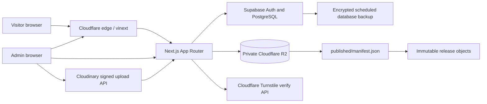
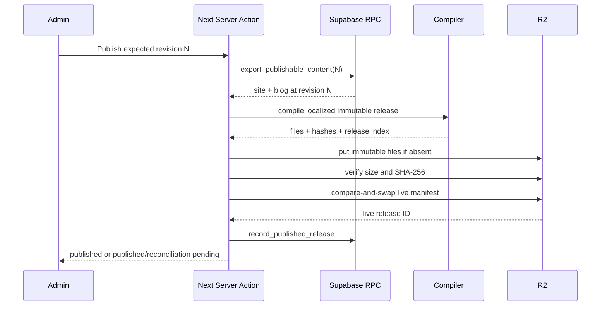
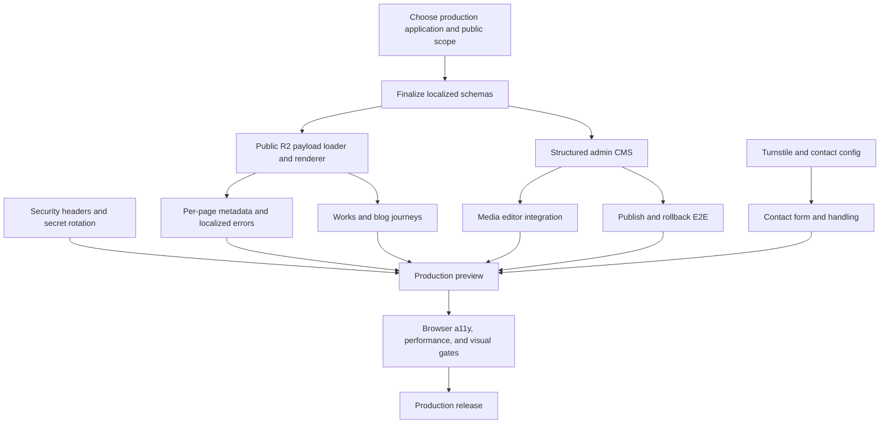

# Product Requirements Document — Abdullah Ahmed Portfolio Platform

| Document field | Value |
| --- | --- |
| Status | Ready for product and engineering review |
| Version | 1.0 |
| Audit date | 2026-08-27 |
| Product | Bilingual personal portfolio, editorial blog, and single-admin CMS |
| Primary target | Repository-root Next.js app deployed to Cloudflare through vinext |
| Legacy baseline | Root Vite/React/Express application |
| Local audit endpoints | Legacy: `http://127.0.0.1:5173`; Next.js: `http://127.0.0.1:3000` |
| Audited repository revision | `ada22e2` plus the uncommitted migration work present on 2026-08-27 |
| Owners | Product owner, design, frontend, platform, and content administration |

## 1. Executive summary

The product is a bilingual Arabic/English portfolio for Abdullah Ahmed. Its intended public experience presents identity, selected work, project case studies, an editorial blog, and a protected contact channel. A single allowlisted administrator manages profile, project, blog, and media content, then publishes an immutable release that can be served from Cloudflare R2 with edge caching and atomic rollback.

The repository currently contains two materially different applications:

1. The **legacy Vite/React/Express application** has the broadest working user interface: public navigation, works archive, bilingual blog discovery and article reading, a custom blog editor, local media, theme/language preferences, and a single-admin dashboard. Its contact and project-detail content are placeholders. Its test files have been removed from the working tree, so `npm test` reports success while executing zero tests.
2. The **Next.js migration application** has the stronger target architecture: canonical localized routes, Supabase authentication and PostgreSQL/RLS, Cloudflare Turnstile, Cloudinary signed uploads, an immutable R2 release compiler, atomic publication/rollback, sitemap/RSS generation, and a Cloudflare/vinext adapter. However, every public page intentionally renders an empty `<main>` and exposes only the floating menu. The compiled release data is not consumed by public route components.

The legacy Vite/Express runtime was removed on 2026-08-28 and the Next.js application was promoted to the repository root. The remaining launch gap is functional and operational: the team must implement the public renderer or explicitly approve a navigation-only public product. For a functioning portfolio, the renderer, contact form, per-page metadata, security headers, correct document language, and deployment gates are P0.

## 2. Document purpose and product boundary

This PRD is both:

- an **as-is technical inventory** of the two implementations found in the repository; and
- a **to-be launch contract** for the Next.js/Cloudflare system.

The launch product includes:

- public localized pages under `/en` and `/ar`;
- portfolio home, works index, project detail, blog index, article detail, and contact;
- navigation, language selection, theme preference, responsive layouts, and reduced-motion behavior;
- admin sign-in, password recovery, content authoring, draft concurrency, publishing, retained releases, and rollback;
- contact-message protection and storage;
- media upload and registration;
- sitemap, RSS, robots, canonical URLs, alternate locales, and article structured data;
- backup, privacy retention, monitoring, and deployment verification.

Out of scope for the current release unless separately approved:

- multiple administrator roles or editorial approval chains;
- visitor accounts, comments, subscriptions, commerce, or payments;
- a general-purpose asset DAM;
- native mobile applications;
- analytics-driven personalization;
- automatic machine translation.

## 3. Product goals and success measures

| Goal | Success measure |
| --- | --- |
| Present a credible bilingual portfolio | All published profile, work, and article content is available in the selected locale without mixed-language fallbacks unless explicitly configured |
| Make selected work easy to discover | A visitor reaches any published project from the localized landing experience in at most three interactions |
| Support editorial publishing safely | An allowlisted administrator can save a draft, resolve revision conflicts, publish, verify the live release, and roll back without direct database or bucket access |
| Capture legitimate enquiries | A verified contact submission is stored once, returns a localized success state, is rate-limited, and expires under the privacy policy |
| Remain fast and stable at the edge | Public routes meet the performance budgets in section 12 and remain readable during a Supabase outage when a valid R2 release exists |
| Be accessible in Arabic and English | Critical journeys pass automated checks plus keyboard, focus-order, screen-reader, RTL, zoom, and reduced-motion review against WCAG 2.2 AA |
| Be operationally reversible | A previous verified R2 release can be restored by changing the manifest, without rebuilding content |

## 4. Personas and permissions

| Persona | Needs | Permissions |
| --- | --- | --- |
| Visitor | Understand the owner, browse work, read articles, change locale/theme, and make contact | Read published content and submit a protected contact request |
| Prospective client/recruiter | Validate capabilities, open project details, find contact information, and share canonical pages | Same as visitor |
| Administrator | Maintain profile, projects, articles, SEO, media, publication state, and rollback history | Supabase-authenticated and present in `admin_users` |
| Search/social crawler | Discover canonical localized pages and metadata | Read SSR HTML, sitemap, RSS, robots, Open Graph, and JSON-LD |
| Operator | Deploy, monitor, restore, rotate secrets, and verify backups | Cloudflare, Supabase, Cloudinary, and CI/CD access outside the product UI |

Authorization must remain server-enforced. Hiding controls in the client is not an authorization boundary.

## 5. Audit method and confidence

### 5.1 Work performed

- Mapped manifests, route files, components, server handlers, schemas, migrations, tests, configuration, and deployment adapters.
- Started and queried both local applications.
- Requested all identified public, admin, feed, sitemap, robot, alias, invalid, and not-found routes.
- Exercised legacy unauthenticated and authenticated session checks, invalid login, valid configured local login, admin-read access, and logout without changing content.
- Exercised Next.js route guards, callback failure redirect, invalid contact validation, unauthorized media APIs, and pagination normalization.
- Ran legacy and Next.js production builds, Next.js/vinext compatibility checks, vinext production build, and dependency audits.
- Inspected responsive CSS, landmarks, ARIA, focus styles, RTL handling, reduced-motion rules, cache headers, and security controls.

### 5.2 Verification results

| Check | Result |
| --- | --- |
| Legacy production build | Pass; largest emitted JS chunk is the blog editor at 932.28 kB minified / 276.61 kB gzip |
| Legacy tests | False-green: command exits 0 but runs 0 tests because the prior test files are deleted in the working tree |
| Next.js tests | Pass: 17/17 |
| Next.js production build | Pass; TypeScript and route generation pass |
| vinext compatibility | 94%; 14 supported, 2 partial, 0 reported issues |
| vinext production build | Pass; large-chunk warning remains |
| Production dependency audit | 0 known vulnerabilities in both applications at audit time |
| Public route HTTP coverage | All identified Next localized routes return 200; aliases redirect; unknown Next paths return 404 |
| Visual regression | Inconclusive: no baseline exists and Chrome was not installed for the browser connector |
| Automated accessibility audit | Inconclusive: the browser engine was unavailable; static issues are documented below |
| Core Web Vitals | Not measured; a real browser and production-like preview are required |

The audit used local development data because no deployed URL was supplied. Mutating publication, rollback, recovery email, contact insertion, and Cloudinary upload flows were not run against external services.

## 6. Current-state product inventory

### 6.1 Legacy application

| Area | Current behavior | State |
| --- | --- | --- |
| Landing page | Deliberately sparse page with theme/language controls and floating navigation | Implemented |
| Works | Animated folder grid, external links, add/edit/delete controls for authenticated admin | Implemented |
| Project detail | Header, back navigation, edit control, and an otherwise empty case-study canvas | Partial |
| Blog index | Localized public/admin modes, search, category/tag/status filters, featured item, pagination-by-reveal | Implemented; current dataset has zero posts |
| Blog article | Rich-block rendering, table of contents, heading tracking, share/copy, related articles, locale alternate | Implemented when data exists |
| Blog authoring | BlockNote editor, autosave queue, local recovery, publish/schedule/unpublish, history, media upload, SEO fields | Implemented |
| Contact | “Coming soon” only | Placeholder |
| Admin | Single username/password session; profile/settings dashboard; project controls on public works page | Implemented |
| Persistence | JSON files plus local media directory; ETag/`If-Match` concurrency | Implemented |
| SEO | Production-only blog metadata, sitemap, RSS, and robots | Partial |

### 6.2 Next.js migration application

| Area | Current behavior | State |
| --- | --- | --- |
| Public routes | Empty `<main>` on home, works, project, blog, article, and contact | Deliberate shell only / launch decision required |
| Floating navigation | Localized four-item animated menu on every public route | Implemented |
| Locale aliases | Legacy paths redirect with 308 to English or localized canonical paths; `page` is normalized | Implemented |
| Published-content compiler | Generates route-specific, checksummed, immutable release files, paged indexes, sitemap, and RSS | Implemented and tested |
| Public content reads | Sitemap and RSS read R2/local release; page components do not | Partial |
| Admin authentication | Supabase password login, claims refresh, allowlist check, sign-out, recovery callback, password reset | Implemented; external happy path not verified |
| CMS | Raw site JSON, structured bilingual blog editor, 650 ms autosave, revision conflict handling, publish, retained releases, rollback | Partial |
| Contact backend | Zod validation, Turnstile, salted IP hash, Supabase RPC, 5/15-minute database limit | Implemented backend only |
| Media backend | Authenticated Cloudinary signature and Supabase asset registration | Implemented backend only |
| Deployment | Next.js 16 plus vinext beta and Cloudflare R2 binding | Build verified |
| Backup | Daily encrypted Supabase logical backup, 30-day artifact retention, contact-message purge | Implemented as GitHub workflow; not execution-verified |

### 6.3 Current content inventory

| Content | Count/state |
| --- | --- |
| Projects | 1 |
| Blog posts | 0 |
| Supported locales | `en`, `ar` |
| Profile source | Arabic scalar fields; English will currently fall back to the same Arabic strings |
| Contact email | Empty |
| Availability | Enabled |

## 7. Information architecture and routes

### 7.1 Canonical public routes

| Route | Purpose | Current Next rendering |
| --- | --- | --- |
| `/` | Redirect to default locale | 307 to `/en` |
| `/{locale}` | Localized landing/home | Empty page plus menu |
| `/{locale}/works` | Paginated project index | Empty page plus menu |
| `/{locale}/works/{slug}` | Project case study | Empty page plus menu |
| `/{locale}/blog` | Paginated article index | Empty page plus menu |
| `/{locale}/blog/{slug}` | Article detail | Empty page plus menu |
| `/{locale}/contact` | Contact information and form | Empty page plus menu |
| `/{locale}/blog/rss.xml` | Locale-specific RSS | Implemented |
| `/sitemap.xml` | Published canonical URL inventory | Implemented |
| `/robots.txt` | Crawl rules and sitemap location | Implemented |

Only `en` and `ar` are valid locale segments. Other locales must return 404.

### 7.2 Compatibility aliases

| Source | Canonical destination |
| --- | --- |
| `/home` | `/en` |
| `/works` | `/en/works` |
| `/works/{slug}` | `/en/works/{slug}` |
| `/blog` | `/en/blog` |
| `/blog/{slug}` | `/en/blog/{slug}` |
| `/blog/en[/{slug}]` | `/en/blog[/{slug}]` |
| `/blog/ar[/{slug}]` | `/ar/blog[/{slug}]` |
| `/contact` | `/en/contact` |

Redirects must preserve only a normalized positive `page` query. Unknown or tracking parameters are intentionally removed.

### 7.3 Admin and API routes

| Route | Method | Authentication | Purpose |
| --- | --- | --- | --- |
| `/admin` | GET | Supabase user plus `admin_users` allowlist | CMS and release management |
| `/admin/login` | GET/client auth | Public | Password sign-in |
| `/admin/recovery` | GET/client auth | Public | Request reset email |
| `/admin/recovery/complete` | GET/client auth | Recovery session | Set new password |
| `/auth/callback` | GET | OAuth/PKCE code | Exchange code and safely redirect under `/admin` |
| `/api/auth/signout` | POST | Session | Sign out and redirect |
| `/api/contact` | POST form data | Public plus Turnstile | Validate and store enquiry |
| `/api/admin/media-signature` | POST JSON | Admin | Create signed Cloudinary upload parameters |
| `/api/admin/media` | POST JSON | Admin | Validate ownership and register uploaded asset |

CMS save, publish, and rollback are Next.js Server Actions rather than public REST endpoints.

## 8. Technical architecture

### 8.1 Technology stack

| Layer | Technology | Version/notes |
| --- | --- | --- |
| Runtime | Node.js | `>=22.12.0`; audited runtime baseline 22.23.2 |
| Language | TypeScript and JavaScript/JSX | Next target uses TypeScript; shared authoring package uses JavaScript/JSX |
| Web framework | Next.js App Router | 16.3.3 |
| UI | React | 19.2.8 |
| Animation | Framer Motion | 13.1.1 range in Next target |
| Rich editor | BlockNote + Mantine | 0.54.0 / 8.3.11 |
| Validation | Zod | 4.4.3 |
| Authentication/database | Supabase Auth + PostgreSQL/RLS | SSR browser/server clients |
| Published object storage | Cloudflare R2 | Private `PORTFOLIO_RELEASES` binding |
| Edge adapter | vinext + Cloudflare Vite plugin | vinext 1.0.0-beta.8; beta risk accepted by ADR |
| Bot protection | Cloudflare Turnstile | Contact submissions |
| Media | Cloudinary | Direct signed image/video uploads; asset metadata in Supabase |
| CI/operations | GitHub Actions | Backup workflow only; no build/test/deploy workflow found |
| Legacy runtime | Vite 8 + Express 5 | Parallel fallback/baseline, not the intended Cloudflare target |

### 8.2 System topology

### 8.3 Architectural pattern

The target is a full-stack Next.js monolith deployed as a Cloudflare Worker, with a deliberate read/write split:

- **Write model:** editable JSON documents in the singleton Supabase `cms_state` row, protected by RLS and revision-aware RPCs.
- **Publish pipeline:** export an exact revision, validate/compile route payloads, upload immutable objects, verify hashes, then atomically switch `published/manifest.json` using conditional writes.
- **Read model:** public pages should resolve the manifest and read small route-specific R2 payloads. Supabase must not be in the public rendering path.
- **Reconciliation:** the R2 manifest is authoritative. Failure to record the published version back in Supabase does not undo a successful publish.
- **Rollback:** verify a retained release and atomically point the manifest to it.

This architecture supports cacheability, fast rollback, and resilience to CMS/database downtime. The public route layer is the missing connection today.

### 8.4 Publish data flow

### 8.5 Release format and constraints

- Release IDs combine an ISO timestamp and ULID-like identifier.
- Payloads carry schema version, minimum renderer version, release ID, locale, kind, SEO, shared chrome, and data.
- Works and blog indexes are capped at 256 KiB and deterministically sharded into query-addressable pages.
- Files are canonical-JSON encoded, NFC normalized, SHA-256 indexed, and verified before manifest activation.
- Slugs accept Unicode letters/numbers separated by hyphens.
- The authoring schema permits up to 500 posts, 150 blocks per list, six nesting levels, 12 tags, 12 gallery items, 20 table rows, and eight table columns.

## 9. Data model

### 9.1 Supabase entities

| Entity | Important fields | Security/retention |
| --- | --- | --- |
| `cms_state` | singleton, draft revision, site JSON, blog JSON, published version/time | RLS; admin read; mutations through security-definer RPCs |
| `admin_users` | user ID, created time | Auth allowlist; RLS restricts user to own row |
| `contact_messages` | name, email, company, project type, message, locale, salted IP hash, expiry | RLS; admin read; service-role insert; default 30-day expiry |
| `cms_import_audits` | source revision, site checksum, blog checksum, import time | RLS; admin read |
| `media_assets` | Cloudinary public ID/URL, resource type, dimensions, bytes, alt, creator | RLS; admin read; server registration |

### 9.2 CMS document model

`site` contains profile, settings, and projects. Project documents support localized title, category, summary, client, role, duration, cover, color, tools, and case-study sections.

`blog` contains posts with independent `ar` and `en` locale entries. Each locale has:

- a mutable draft snapshot;
- an optional live snapshot and publication time;
- an optional scheduled snapshot and future publication time;
- title, excerpt, slug, category, tags, cover/alt, SEO fields, featured state, and a structured rich-text document.

The profile model is currently scalar rather than localized. This must be normalized before claiming complete bilingual coverage.

### 9.3 Rich content types

Supported normalized blocks include paragraphs, headings, bullet/number/check/toggle lists, quote, callout, code, divider, table, image, gallery, video, audio, approved video embed, button, and two/three-column layouts. The current BlockNote authoring UI does not expose every renderer-supported custom block.

## 10. User flows and workflows

### 10.1 Visitor discovery

1. Visitor opens `/` or a legacy alias.
2. System redirects to a canonical locale route, defaulting to English.
3. SSR HTML sets the correct document language/direction and exposes readable content and navigation.
4. Visitor changes locale without losing the equivalent page when an alternate exists; otherwise the locale index is used.
5. Visitor selects Home, Works, Blog, or Contact through native links.
6. The selected canonical route loads the corresponding immutable release payload.

### 10.2 Works flow

1. Visitor opens localized works index and optional page number.
2. System loads published project summaries from R2.
3. Visitor activates a project card/folder with pointer, touch, or keyboard.
4. Motion runs unless reduced motion is requested.
5. Project route renders localized title, summary, metadata, tools, media, sections, and safe external link.
6. Missing or unpublished slugs return a localized 404, not an empty 200.

### 10.3 Blog discovery and reading

1. Visitor opens localized blog index.
2. Published articles appear newest first; featured content is visually identified.
3. Search, category, and tag filtering work locally within the loaded release page or through documented query parameters.
4. Pagination has stable canonical URLs.
5. Article detail renders rich blocks, table of contents, reading time, metadata, related content, share/copy, and locale alternate.
6. RSS and sitemap include only public snapshots.

### 10.4 Contact submission

1. Visitor opens localized contact page and sees contact information plus labelled fields.
2. Client validates required fields and length constraints without replacing server validation.
3. Turnstile produces a token; the client submits form data to `/api/contact`.
4. Server validates with Zod, verifies Turnstile, derives a salted IP hash, and invokes `submit_contact_message`.
5. RPC enforces the submission limit and stores the message with a 30-day expiry.
6. UI displays a localized success, field error, verification error, rate-limit message, or retryable service error and prevents accidental duplicate submission.

### 10.5 Admin authentication and recovery

1. Admin signs in with Supabase password authentication.
2. Server refreshes claims and confirms the user ID exists in `admin_users`.
3. Non-allowlisted users remain unauthorized even with a valid Supabase account.
4. Recovery email returns a non-enumerating response and routes through the safe callback.
5. Callback accepts only redirects under `/admin`.
6. Admin sets a password of at least 12 characters and returns to the CMS.
7. Sign-out uses POST, clears the session, and redirects to login.

### 10.6 Draft save and conflict recovery

1. Admin edits a structured field or document.
2. Client stores a recoverable local copy and schedules a serialized autosave.
3. Save sends expected revision N to `update_cms_draft`.
4. RPC updates only if N is current, increments the revision, and returns N+1.
5. On conflict, UI preserves the local recovery copy and offers reload/compare; it must not silently overwrite another session.
6. On success, recovery data may be cleared only after the server revision is confirmed.

### 10.7 Publish and rollback

1. Admin explicitly publishes a confirmed saved revision.
2. Compiler rejects invalid revision, slug, required localized title, duplicate file key, or oversized index entry.
3. Repository writes and verifies all immutable files.
4. Conditional manifest switch makes the release live.
5. Admin sees the live release ID and reconciliation status.
6. Rollback selects a retained compatible release, verifies every file, and conditionally switches the manifest.

### 10.8 Media upload

1. Admin selects an allowed image or video and supplies alt text where required.
2. Client requests a short-lived signed upload for the resource type.
3. Browser uploads directly to the fixed `portfolio` Cloudinary folder under server-enforced size/type limits.
4. Client posts returned metadata to `/api/admin/media`.
5. Server verifies the Cloudinary tenant/folder and stores metadata with the admin user ID.
6. Editor inserts the registered URL and alt text into the content document.

## 11. Functional requirements

Priority definitions: **P0** launch blocker, **P1** required for a complete production release, **P2** valuable follow-up.

| ID | Requirement | Priority | Dependencies | Current state / acceptance criterion |
| --- | --- | --- | --- | --- |
| FR-001 | Declare one production application and command | P0 | Product/operations decision | Root and Cloudflare targets cannot remain ambiguous; CI and runbook point to the same artifact |
| FR-002 | Serve canonical `en`/`ar` routes and aliases | P0 | Proxy | Implemented; add E2E coverage for all aliases and query normalization |
| FR-003 | Render published R2 payloads on every public page | P0 | Release store, route keys, page components | Missing; each route must show release content or an explicit release-unavailable state |
| FR-004 | Preserve a deliberate minimal landing mode without removing accessible identity | P1 | Product decision, home renderer | Current page is empty; final behavior must be explicitly approved and testable |
| FR-005 | Provide native-link public navigation with current-route state | P0 | Localized chrome | Buttons must become links or offer equivalent browser semantics |
| FR-006 | Provide an equivalent-page Arabic/English switcher | P0 | Locale alternates, canonical routes | Missing from Next public UI |
| FR-007 | Provide system/light/dark theme selection and persistence | P1 | Theme bootstrap, cookie | Present in legacy, absent in Next UI |
| FR-008 | Return localized 404/unavailable states for bad locale, slug, page, or missing release | P0 | Error boundaries, release reads | Generic Next 404 only; page-specific states missing |
| FR-010 | Render localized profile identity, role, bio, availability, featured work, and latest articles | P0 | Localized profile schema, release payload | Compiler exists; UI missing |
| FR-011 | Localize profile and site settings explicitly | P0 | CMS schema migration | Current English payload falls back to Arabic scalar fields |
| FR-020 | Render paginated works summaries | P0 | `works/{locale}-index[-pN].json` | Compiler exists; UI missing |
| FR-021 | Render complete localized project case studies | P0 | Project document schema and renderer | Both legacy detail canvas and Next page are empty |
| FR-022 | Support structured project create/edit/delete and publish state | P1 | Admin CMS, revision RPC | Legacy controls are partial; Next structured UI missing |
| FR-023 | Validate project URLs, slugs, localized titles, media alt, and section schema | P1 | Shared Zod schema | Compiler performs only part of validation |
| FR-030 | Render published blog listing, featured item, pagination, category/tag filters, and search | P0 | Blog release index | Legacy has behavior; Next UI missing |
| FR-031 | Render article blocks, TOC, related articles, share, reading time, and locale alternate | P0 | Rich renderer, article payload | Legacy has behavior; Next UI missing |
| FR-032 | Support draft, publish, schedule, cancel schedule, unpublish, restore history, and delete per locale | P1 | Blog schema, CMS actions | Next admin exposes only draft and immediate publish |
| FR-033 | Enforce unique slugs per locale and stable canonical paths | P0 | Compiler/shared validation | Duplicate release keys fail late; admin must show actionable validation earlier |
| FR-034 | Preserve forward-compatible normalized rich blocks | P1 | Shared authoring package | Implemented in schema/compiler; authoring parity remains incomplete |
| FR-040 | Render localized contact information and form | P0 | Contact page, profile email, Turnstile site key | Backend exists; Next UI and current email are missing |
| FR-041 | Validate and localize contact states client and server side | P0 | Zod, UI copy | Server errors are English-only; UI absent |
| FR-042 | Enforce durable abuse limits and duplicate protection | P0 | Turnstile, atomic DB limiter | Current count-then-insert RPC can race under concurrent requests |
| FR-043 | Provide an admin contact inbox or documented external handling workflow | P1 | `contact_messages` access | Database stores messages; no consumer UI/notification exists |
| FR-050 | Authenticate with Supabase and enforce `admin_users` on every protected operation | P0 | Supabase Auth/RLS | Implemented; happy path needs preview E2E |
| FR-051 | Support non-enumerating password recovery and safe callback redirect | P0 | Supabase email settings | Implemented; callback error must be visible on login page |
| FR-052 | Sign out through POST and invalidate the session | P0 | Supabase SSR cookies | Implemented |
| FR-060 | Offer structured profile, settings, works, and blog editing | P1 | CMS components | Site content is currently raw JSON in Next admin |
| FR-061 | Autosave every edited domain through one serialized revision queue | P1 | Draft RPC, recovery storage | Site-only edits do not trigger the current blog-keyed autosave |
| FR-062 | Preserve and expose local recovery data after save/network failure | P1 | Browser storage, conflict UI | Partial; needs deterministic lifecycle tests |
| FR-063 | Publish only a saved expected revision | P0 | Export RPC, compiler | Implemented and unit-tested |
| FR-064 | List retained releases and perform verified rollback | P0 | R2 list/read/write | Implemented; pagination/retention work remains |
| FR-070 | Upload registered media through signed direct Cloudinary requests | P1 | Cloudinary config, admin auth | Backend only; no Next editor integration |
| FR-071 | Enforce upload MIME, byte, duration/dimension, and folder restrictions before storage cost is incurred | P0 | Signed upload constraints | Current signature fixes folder/type but does not enforce maximum upload size/formats |
| FR-080 | Generate localized title, description, canonical, hreflang, Open Graph, and article JSON-LD in SSR HTML | P0 | Page payload SEO, Next metadata API | Missing; only generic root metadata exists |
| FR-081 | Generate public-only sitemap, RSS, and robots | P0 | Release compiler/store, site origin | Implemented; add schema and production-origin tests |
| FR-090 | Import legacy content idempotently with checksums and audit record | P1 | Import script, Supabase | Plan/compiler exist; full execution/runbook not verified |
| FR-091 | Make deployment repeatable through CI with test/build/adapter/smoke gates | P0 | GitHub Actions, Cloudflare secrets | Missing; only database backup workflow exists |

## 12. Non-functional requirements

### 12.1 Performance

| Metric/constraint | Requirement |
| --- | --- |
| LCP | p75 ≤ 2.5 s on mobile and desktop production traffic |
| INP | p75 ≤ 200 ms |
| CLS | p75 ≤ 0.10 |
| TTFB | p75 ≤ 800 ms for cached public HTML; p75 ≤ 1.5 s for uncached edge render |
| Route payload | Works/blog index JSON ≤ 256 KiB as already enforced |
| Public JavaScript | Initial route JS budget ≤ 150 KiB gzip, excluding lazy admin/editor code |
| Images | Responsive dimensions, modern formats, explicit width/height or aspect ratio, lazy loading below fold |
| Fonts | Prefer self-hosted/subset fonts; avoid CSS `@import` in the critical path |
| Caching | Public GET/HEAD: `s-maxage=300`, `stale-while-revalidate=86400`, `stale-if-error=86400`; admin/API: private/no-store |
| Admin editor | Load BlockNote only inside authenticated authoring routes |

No Core Web Vitals claim is permitted until measured on a production-like Cloudflare preview. The current large-chunk warnings must be triaged before the performance gate is considered passed.

### 12.2 Security

- No credential or secret may be committed, emitted into a client bundle, logged, or included in a PRD/test artifact.
- The populated Supabase server-secret-shaped value formerly present in `.env.example` was removed on 2026-08-28. It must still be rotated if it was ever valid.
- Supabase service credentials remain server-only. Browser and user-scoped server clients use only the publishable key.
- All admin operations re-check the authenticated claims and `admin_users` allowlist server-side.
- RLS remains enabled on every public schema table. Security-definer functions must set a fixed `search_path` and expose execute only to the intended roles.
- Add CSP, HSTS in production, `frame-ancestors 'none'`, `X-Content-Type-Options: nosniff`, strict referrer policy, permissions policy, and removal of `X-Powered-By` to the Next target.
- CSP must be narrowly configured for Supabase, Cloudinary, Turnstile, required frames, and self-hosted/static assets.
- Admin responses, tokens, media signatures, and errors use `private, no-store`.
- Contact and JSON request bodies have explicit small platform limits; media bytes go directly to Cloudinary.
- Rate limiting must use a trusted Cloudflare client IP and an atomic database or durable mechanism. Do not trust arbitrary forwarded headers outside the declared proxy topology.
- Login and recovery abuse controls must be configured and monitored at Supabase/edge level.
- External URLs are normalized to HTTPS where required; embedded media remains host-allowlisted and sandboxed.
- Dependencies are audited in CI; high/critical production vulnerabilities block release.

### 12.3 Accessibility

- Meet WCAG 2.2 AA for public and admin experiences.
- Set `<html lang>` and direction correctly per localized document, not only on an inner container.
- Every page has one descriptive H1 and meaningful landmarks. A working skip link must be present when repeated navigation exists.
- All navigation uses links with clear names; buttons are reserved for actions.
- Closed-menu controls must be removed from the focus order/inert, not merely placed under `aria-hidden`.
- Floating menu supports Escape, outside click, logical focus entry/return, current-page indication, and 200% zoom.
- Modal editors and confirmations trap focus, restore focus on close, and prevent background interaction.
- All inputs have programmatic labels, errors are associated with fields, and async status uses appropriate live regions.
- Images require meaningful localized alt text or explicit decorative treatment.
- Full keyboard navigation must work in LTR and RTL.
- `prefers-reduced-motion` must disable Framer Motion timelines as well as CSS transitions.
- Minimum target size is 24×24 CSS px, with 44×44 preferred for primary touch actions.
- Contrast, screen-reader landmarks, focus order, and reflow must be manually verified in addition to automated axe checks.

### 12.4 Reliability, consistency, and recovery

- Public pages continue serving the last valid R2 release during Supabase outages.
- Release activation remains all-files-verified and compare-and-swap atomic.
- Publication and rollback conflicts return an actionable error without losing the candidate release.
- R2 listing must paginate through all objects and apply a documented retention policy; live and explicitly pinned rollback releases must never be deleted.
- Draft edits use optimistic concurrency and a single serialized client queue.
- Daily encrypted database backup has an RPO of 24 hours and a target RTO of 4 hours.
- Restore tests run at least quarterly and verify content, admin allowlist, import audit, and media metadata.
- Contact expiry does not depend solely on a workflow that may be disabled; add database scheduling or monitor the purge job.

### 12.5 Privacy

- Collect only the contact fields in this PRD and retain them for no more than 30 days unless a documented business/legal basis changes.
- Store a salted one-way IP hash for rate limiting, never a raw IP in the application table or logs.
- Keep contact-message rows out of logical backup data, as the current workflow does.
- Publish a privacy notice covering contact submission, Turnstile, Cloudinary media, Supabase, and operational logs.
- Define an operator process for access and deletion requests.

### 12.6 SEO and internationalization

- SSR HTML must contain meaningful localized text; client-only content is not sufficient.
- Every public route provides canonical URL, locale alternate links including `x-default`, unique title/description, Open Graph/Twitter fields, and correct `og:locale`.
- Article pages include valid `BlogPosting` JSON-LD and project pages may include `CreativeWork` where accurate.
- Sitemap and RSS use the configured production origin and never default to `portfolio.example` in production.
- Dates, numbers, reading times, arrows, and layout direction follow locale.
- Content fallback rules are explicit. Missing English content must be marked unavailable or intentionally fall back with an editor warning; silent Arabic copy on English pages is not acceptable.

### 12.7 Maintainability and compatibility

- Pin Next.js, vinext, Cloudflare adapter, and schema versions through the lockfile.
- Re-run tests, `next build`, `vinext check`, `vinext build`, and Worker smoke tests before dependency upgrades.
- Keep release, compiler, and repository modules adapter-neutral.
- Share schemas between editor, compiler, importer, and renderer to prevent late publication failures.
- Remove dead public CSS/components or restore their renderer; do not ship both indefinitely.
- Add linting, formatting, type checking, and coverage thresholds to CI.
- Update ADR compatibility evidence when the observed score changes; it is now 94%, not the recorded 91%.

### 12.8 Observability

- Emit structured logs with request ID, route, status, duration, release ID, source revision, and safe error code.
- Never log tokens, contact body, email, passwords, service credentials, or raw IP.
- Monitor 5xx rate, contact failures/rate limits, auth failures, publish/rollback conflicts, Supabase reconciliation failures, missing R2 payloads, and Cloudinary registration failures.
- Alert on sitemap/feed failure, backup failure, contact purge failure, and manifest/object checksum mismatch.
- Track release and rollback actions in an immutable operator audit trail.

## 13. External integrations

| Integration | Use | Required configuration | Current status and fallback |
| --- | --- | --- | --- |
| Supabase Auth | Password login, recovery, SSR session | Public URL/key; auth redirect URLs; email provider | UI and guards implemented; full external happy path unverified |
| Supabase PostgreSQL | CMS source, admin allowlist, contacts, media metadata, import audit | Server URL/secret; migrations; RLS/RPC grants | Schema implemented; local server secret is not configured |
| Cloudflare R2 | Immutable public releases and live manifest | Private `PORTFOLIO_RELEASES` binding and bucket | Adapter implemented; local Next uses in-memory seed |
| Cloudflare Workers/vinext | Edge runtime and cache | Wrangler config, compatibility date, secrets, deployed Worker | Build passes; vinext remains beta with two partial config notes |
| Cloudflare Turnstile | Contact bot protection | Public site key and secret key | Server verify implemented; public widget/form and local keys missing |
| Cloudinary | Direct image/video storage | Cloud name, API key, secret, upload constraints | Signature/registration APIs implemented; editor integration and local keys missing |
| Google Fonts | El Messiri font | External CSS/font origins | Used through CSS `@import`; self-hosting is recommended |
| GitHub Actions | Encrypted database backup and purge | Database URL and age recipient secrets | Workflow exists; no evidence of successful run; no build/deploy CI |

## 14. Technical issues and weaknesses

| ID | Severity | Finding/evidence | Impact | Required response |
| --- | --- | --- | --- | --- |
| T-001 | Critical / P0 | Every Next public page is intentionally `EmptyPublicPage`; tests assert the floating menu is the only public UI | Portfolio, work, article, and contact value is absent despite 200 responses | Decide scope, then connect route components to release payloads before portfolio launch |
| T-002 | Resolved 2026-08-28 | The legacy runtime was removed and the Next.js app was promoted to the repository root | One release artifact remains | Keep CI and deployment rooted at the repository root |
| T-003 | Remediated 2026-08-28 | The populated server-secret-shaped example value was replaced with a blank placeholder | Rotation remains required if the value was ever valid | Rotate the credential and add secret scanning before launch |
| T-004 | High / P0 | Public route components never call `getLivePayload`; only sitemap/RSS consume release data | Sophisticated publishing pipeline does not reach users | Implement shared page loader, schema check, unavailable state, and metadata generation |
| T-005 | High / P0 | Contact page is empty and Turnstile/client submission UI is absent | No enquiry flow; backend cannot be reached normally | Build localized form and configure keys |
| T-006 | High / P0 | Next responses expose `X-Powered-By` and no CSP/HSTS/anti-framing/referrer/permissions headers were observed | Reduced defense in depth | Configure platform response headers and production tests |
| T-007 | High / P0 | Root `<html lang="en">` remains English for `/ar`; only an inner div is RTL | Incorrect screen-reader language, SEO, and browser behavior | Set document-level locale/direction through supported layout strategy |
| T-008 | High / P0 | Public pages have no H1 or meaningful content, canonical, hreflang, Open Graph, or JSON-LD | Poor accessibility, discovery, and sharing | Implement SSR renderer and per-page metadata |
| T-009 | High / P0 | Existing profile data is Arabic-only scalar content; English compiler fallback repeats it | English experience is not actually localized | Migrate profile/settings to localized schema and warn on missing locale |
| T-010 | High / P1 | Closed floating-menu items are under `aria-hidden` but remain buttons without `disabled`, `tabIndex=-1`, or inert handling | Keyboard focus can enter hidden content | Remove closed items from focus order and test focus lifecycle |
| T-011 | Medium / P1 | Menu destinations are JavaScript buttons using `router.push`, not anchors | No native open/copy/new-tab behavior; weaker semantics | Use `Link`/anchors and `aria-current` |
| T-012 | High / P1 | Next public UI has no locale or theme switcher | Bilingual and theme functionality is inaccessible | Add persistent localized controls |
| T-013 | High / P1 | Next site CMS is raw JSON; blog editor lacks legacy schedule, unpublish, delete, history, featured, alt, and upload workflows | High authoring risk and feature regression | Implement structured, schema-driven controls and parity tests |
| T-014 | Medium / P1 | CMS autosave returns early when only site JSON changes because it keys change detection to `blogValue` | Site edits require manual save and can be lost unexpectedly | Track both domains in one serialized queue |
| T-015 | High / P0 | Cloudinary signature fixes folder/resource type but does not constrain upload size/formats before direct upload | Abuse/storage-cost risk occurs before registration validation | Sign an upload preset/transformation with strict MIME and size limits |
| T-016 | High / P0 | Contact limiter counts then inserts without an atomic lock/advisory mechanism | Concurrent requests can exceed the stated limit | Replace with atomic rate-limit function/table or edge durable limiter |
| T-017 | Medium / P1 | Contact IP fallback accepts `x-forwarded-for` when Cloudflare header is absent | Spoofable rate key outside controlled topology | Require trusted proxy headers or platform-derived address only |
| T-018 | High / P0 | Legacy `npm test` executes zero tests and still exits successfully | False confidence during migration | Fail CI on zero tests or remove legacy from release path after parity |
| T-019 | Medium / P1 | Next tests are mostly unit/source assertions; no browser, API integration, auth, contact, a11y, or Worker E2E suite | Major regressions can pass | Add layered tests in section 16 |
| T-020 | Medium / P1 | Both Vite and vinext report chunks above 500 kB; Next editor chunk is about 900 kB raw | Slow admin load; public risk if boundaries regress | Measure gzip/route ownership and split editor features |
| T-021 | Medium / P1 | R2 `list` reads one page and there is no release garbage-collection policy | Retained release list becomes incomplete and storage grows indefinitely | Implement cursor pagination, pinning, and safe retention |
| T-022 | Medium / P1 | Backup/purge is the only CI workflow; no test/build/deploy/security gate exists | Broken or insecure builds can deploy | Add pull-request and deployment workflows |
| T-023 | Medium / P1 | Callback redirects include `?error=...`, but login UI does not display callback query errors | Recovery failures are opaque | Map safe error codes to visible non-sensitive messages |
| T-024 | Medium / P1 | Public CSS contains a complete unused portfolio renderer while page components are empty | Dead code and unclear product intent | Remove it or restore components under tested ownership |
| T-025 | Medium / P1 | Contact messages are stored but no inbox, notification, or handoff is implemented | Leads may never be seen | Build admin inbox or document a secure external consumer |
| T-026 | Low / P2 | RSS lacks richer channel metadata and production output depends on configured origin | Feed quality and deployment mistakes | Add language/description/self-link and fail production on missing origin |
| T-027 | Medium / P1 | No custom page error/loading/not-found boundaries or public R2 outage UX exist | Failures degrade to generic framework behavior | Add localized error states and retry/last-release handling |
| T-028 | Medium / P1 | No runtime observability or manifest integrity monitoring was found | Operators learn about failures from users | Implement section 12.8 |
| T-029 | Medium / P1 | Visual/a11y regression baseline and real-browser QA are absent | Layout, RTL, focus, and motion regressions are unguarded | Add Playwright + axe and committed visual baselines |
| T-030 | Low / P2 | Google font is loaded with CSS `@import` | Extra render blocking, privacy dependency, and CSP complexity | Self-host/subset and preload the font |

## 15. Dependencies and delivery order

### 15.1 Recommended phases

| Phase | Scope | Exit criteria |
| --- | --- | --- |
| Phase 0 — ownership and safety | Choose runtime, protect/rotate secrets, establish CI, freeze canonical schema | One deploy artifact; no repository secrets; CI blocks zero tests and failed builds |
| Phase 1 — public vertical slice | Home, works index/detail, blog index/detail read R2; metadata; language/theme; errors | All canonical routes render meaningful SSR content in both locales |
| Phase 2 — conversion and administration | Contact UI/inbox, structured profile/projects/blog, media integration, recovery | Admin can complete every non-destructive flow on preview; contact reaches documented owner |
| Phase 3 — release hardening | Security headers, rate-limit atomicity, retention, observability, backups, rollback drill | Security/a11y/performance/restore/rollback gates pass |
| Phase 4 — migration and cutover | Import content, verify checksums, deploy Worker, redirect legacy, monitor | Production smoke suite passes and rollback plan is rehearsed |

## 16. Test and acceptance strategy

| Test layer | Required coverage |
| --- | --- |
| Unit | Locale/slug/schema validation, canonical JSON, compiler sharding, payload compatibility, rate-limit logic, safe redirects, Cloudinary signing/ownership |
| Database | RLS for every role, allowlist behavior, atomic revision conflicts, contact limit under concurrency, RPC grants, expiry purge |
| Contract | Every release payload validates against renderer schema; old compatible release remains renderable |
| Integration | Supabase auth/recovery, draft save, publish reconciliation, R2 conditional manifest, rollback, Turnstile success/failure, Cloudinary upload/register |
| HTTP | Route status, cache/security headers, aliases, canonical query normalization, robots/sitemap/RSS, localized 404, API error envelopes |
| Browser E2E | Navigation, locale/theme persistence, works/project, blog/filter/article/share, contact valid/invalid/rate limit, admin login/logout, edit/save/conflict/publish/rollback |
| Accessibility | axe on every template plus manual keyboard, focus, VoiceOver/NVDA, RTL, 200%/400% zoom, reduced motion, contrast |
| Visual | 375, 768, and 1440 px baselines for both locales and themes; ≤5 px unexplained layout shift |
| Performance | Lighthouse/lab on preview plus field Web Vitals; public and admin bundles tracked per route |
| Security | Secret scan, dependency audit, header/CSP scan, auth/RLS negative tests, upload abuse, request-size, rate-limit, open-redirect checks |
| Operations | Encrypted backup restore, missing/corrupt R2 object, Supabase outage, Cloudinary outage, manifest conflict, rollback drill |

### 16.1 P0 release acceptance checklist

- [ ] One production artifact and deployment command are approved.
- [ ] No valid secret exists in tracked or example files; suspected credentials are rotated.
- [ ] All public canonical routes render meaningful SSR content from a verified release.
- [ ] English and Arabic content, document language/direction, equivalent-page switching, and metadata are correct.
- [ ] Works and project detail are complete enough to communicate at least the current project.
- [ ] Blog empty state and article journey are correct; feeds and sitemap match published data.
- [ ] Contact form completes with Turnstile, atomic rate limiting, localized states, and a monitored handling destination.
- [ ] Admin login/recovery/logout, save/conflict, publish, and rollback pass in a staging project with test credentials.
- [ ] Cloudinary upload constraints are enforced before upload and asset registration is connected to the editor.
- [ ] Security headers and no-store rules pass on production-like responses.
- [ ] Automated tests cannot pass with zero executed tests.
- [ ] Browser accessibility, keyboard, visual, and Core Web Vitals gates pass.
- [ ] Backup restore and rollback drills succeed.

## 17. Risks and mitigations

| Risk | Probability | Impact | Mitigation |
| --- | --- | --- | --- |
| vinext beta differs from standard Next runtime | Medium | High | Pin version; run Worker E2E; retain documented OpenNext reversal trigger |
| Public renderer and compiler schemas diverge | High until implemented | High | Shared schemas, contract tests, minimum renderer version gate |
| Wrong app is deployed | High without CI | Critical | Single root release command and artifact provenance |
| Service credential exposure | Unknown | Critical | Rotate, secret scan, platform secrets only |
| Bilingual content is incomplete | High with current data | High | Locale completeness dashboard and publish-time validation |
| Concurrent editors overwrite work | Medium | High | Revision RPC plus serialized autosave and explicit recovery comparison |
| R2 release growth or truncated listing | Medium over time | Medium | Cursor pagination and safe retention/pinning |
| Contact abuse or missed leads | Medium | High | Atomic limit, Turnstile, request limits, inbox/notification, monitoring |
| Rich editor bundle harms public performance | Low if boundary holds | Medium | Auth-only lazy loading and route bundle budgets |
| Accessibility regressions in animated menu/editor | High without browser tests | High | Focus design, reduced-motion implementation, Playwright/axe/manual gates |

## 18. Open product decisions

These decisions block final acceptance criteria and should be recorded in an ADR or approved product note:

1. Is the navigation-only public shell a temporary migration state, or is an intentionally blank experience desired on all public routes? The latter conflicts with the portfolio, blog, works, contact, sitemap, and release data already implemented.
2. Should the landing page remain visually silent while Works/Blog/Contact render normally, or should it show profile and featured content produced by the compiler?
3. Is vinext the committed production runtime after preview validation, or should the team exercise the ADR’s OpenNext fallback before public launch?
4. Should missing locale content fall back, remain unpublished, or display a labelled fallback? Silent cross-language fallback is not acceptable.
5. Where are contact messages handled: an admin inbox, secure email notification, CRM, or operational Supabase view?
6. What is the R2 release retention count/age, and which releases may be pinned?
7. Are projects independently draft/published, or does every project in `site.projects` publish with the site revision?
8. Is dark theme still a product requirement for the Next migration, given that its styling tokens remain but its switcher does not?

## 19. Definition of done

The product is complete when the chosen production application satisfies all P0 requirements, every public and admin route has a documented owner and acceptance test, a verified immutable release is rendered consistently in Arabic and English, contact and administration work on a production-like preview, security/accessibility/performance/backup gates pass, and an operator can deploy and roll back using the runbook without editing source data or infrastructure manually.
